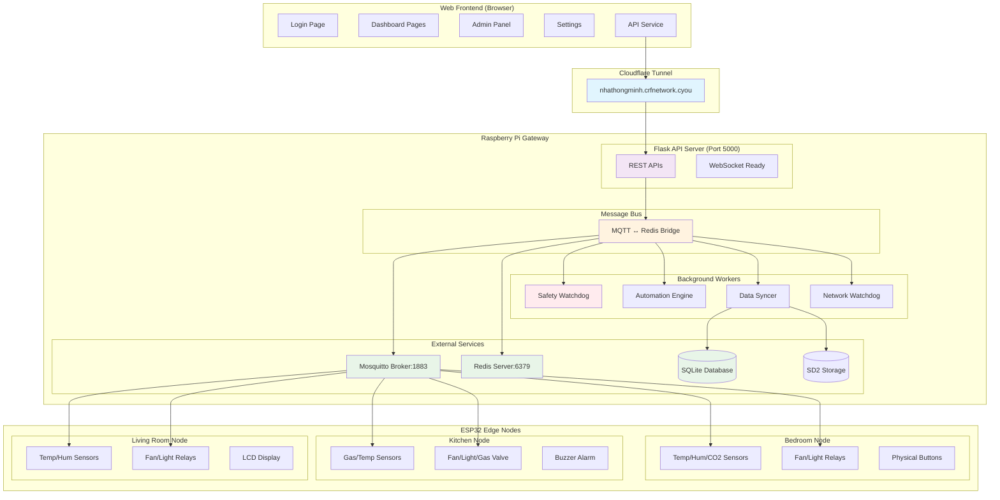
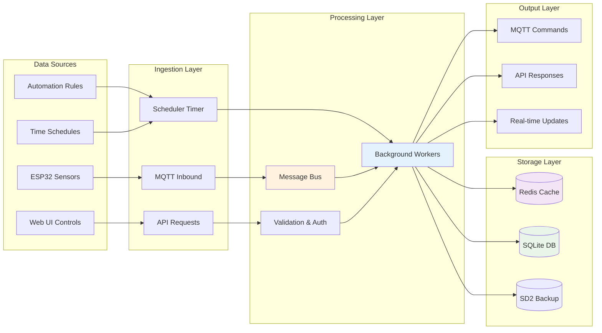
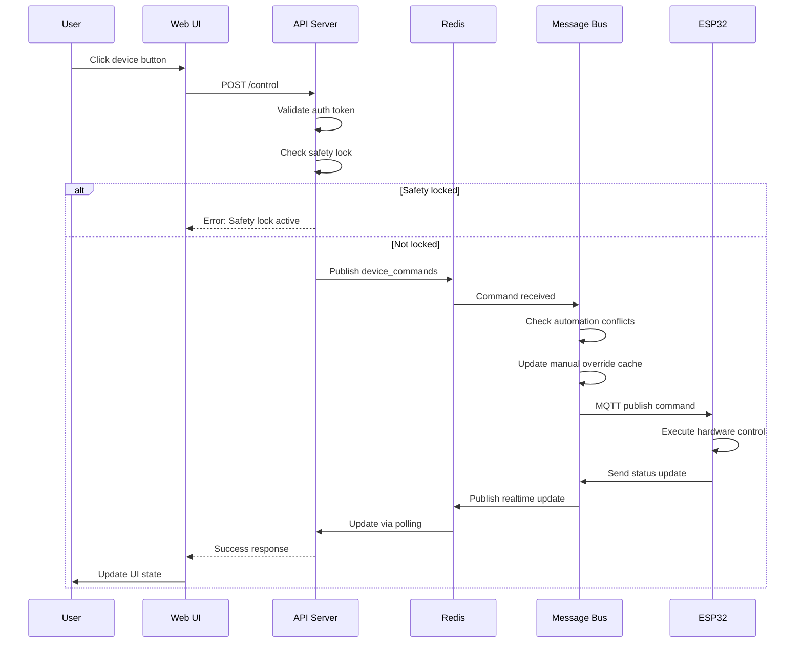
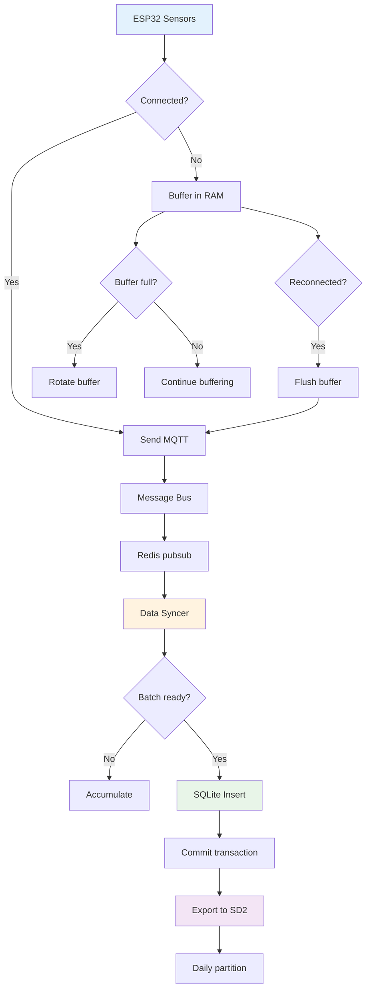
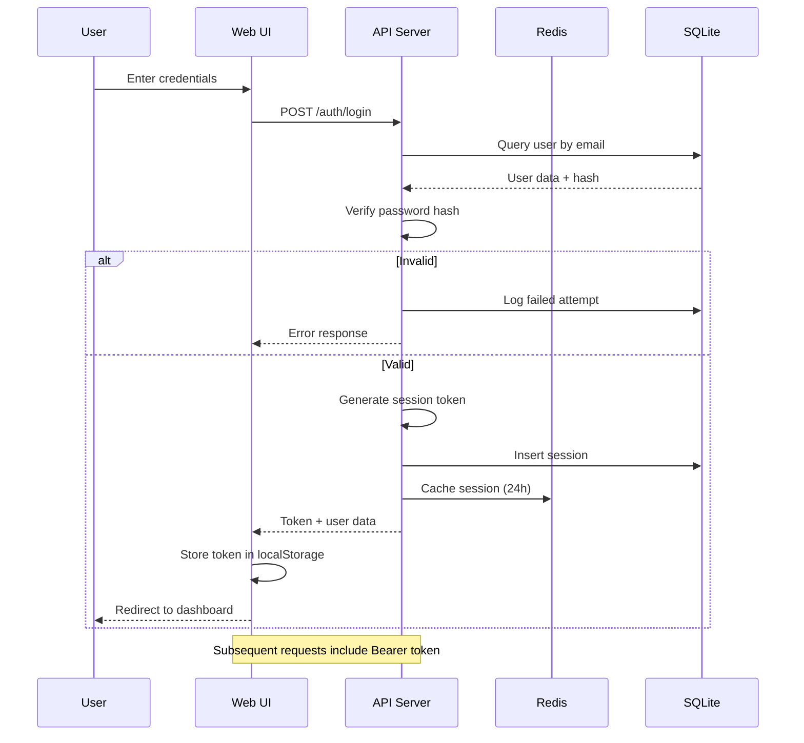
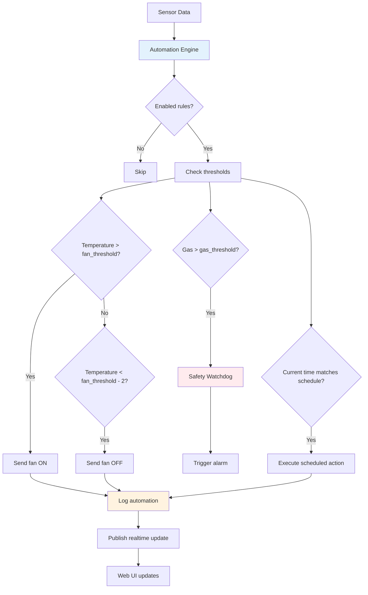
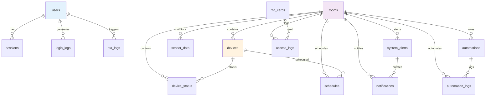
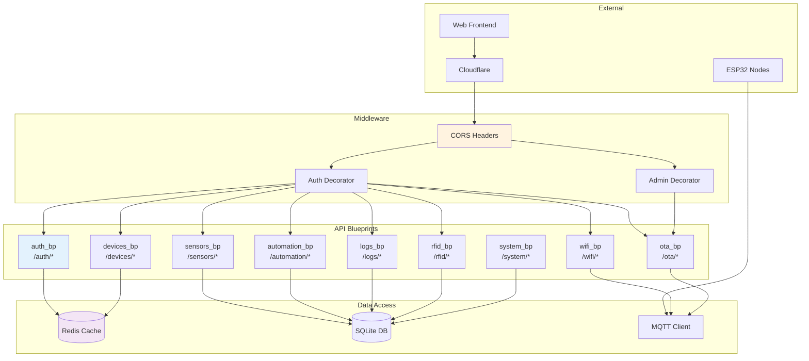

# System Architecture Diagrams

## 1. Overall System Architecture



## 2. Data Flow Architecture



## 3. Safety System Flow

```mermaid
stateDiagram-v2
    [*] --> Monitoring

    state Monitoring as "Continuous Monitoring"
    state Alert as "Danger Detected"
    state Lock as "Safety Lock Active"
    state Mute as "User Muted"
    state Normal as "Normal Operation"

    Monitoring --> Alert: Gas > threshold\nOR Fire detected
    Alert --> Lock: Set safety lock
    Lock --> Hardware: Turn on fan\nSound alarm
    Hardware --> Alert: Send alert to DB
    Alert --> Web: Push notification
    Web --> User: Show red alert
    User --> Mute: User clicks mute
    Mute --> Timer: 10 min countdown
    Timer --> Check: Still dangerous?
    Check --> Alert: Yes → Re-alert
    Check --> Normal: No → Clear lock
    Normal --> Monitoring

    note right of Lock
        All manual controls
        are blocked
    end note

    note right of Mute
        Alarm silenced but
        monitoring continues
    end note
```

## 4. Device Control Flow



## 5. Sensor Data Pipeline



## 6. Authentication Flow



## 7. Automation Engine Flow



## 8. Database Schema Relationships



## 9. API Architecture



## 10. Deployment Architecture

```mermaid
graph TB
    subgraph "Development"
        DEV[Developer Machine]
        GIT[Git Repository]
        PIO[PlatformIO]
    end

    subgraph "Raspberry Pi (Production)"
        RP[Raspberry Pi 4B]
        GW[Gateway Software]
        CF_T[Cloudflare Tunnel]
        HOTSPOT[WiFi Hotspot]
    end

    subgraph "ESP32 Nodes"
        ESP_B[Bedroom ESP32]
        ESP_K[Kitchen ESP32]
        ESP_L[Living Room ESP32]
    end

    subgraph "Cloud Services"
        CF_C[Cloudflare Edge]
        DNS[DNS: nhathongminh.crfnetwork.cyou]
    end

    subgraph "User Access"
        BROWSER[Web Browser]
        MOBILE[Mobile Device]
    end

    DEV --> GIT
    GIT --> RP
    PIO --> ESP_B
    PIO --> ESP_K
    PIO --> ESP_L

    GW --> CF_T
    GW --> HOTSPOT

    HOTSPOT --> ESP_B
    HOTSPOT --> ESP_K
    HOTSPOT --> ESP_L

    CF_T --> CF_C
    CF_C --> DNS

    DNS --> BROWSER
    DNS --> MOBILE

    style RP fill:#e3f2fd
    style CF_C fill:#e1f5fe
    style HOTSPOT fill:#fff3e0
```</content>
<parameter name="filePath">/home/pi/smarthome_prj/SYSTEM_DIAGRAMS.md